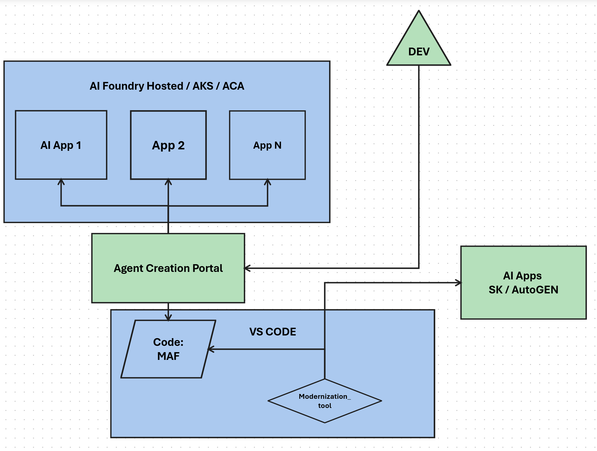
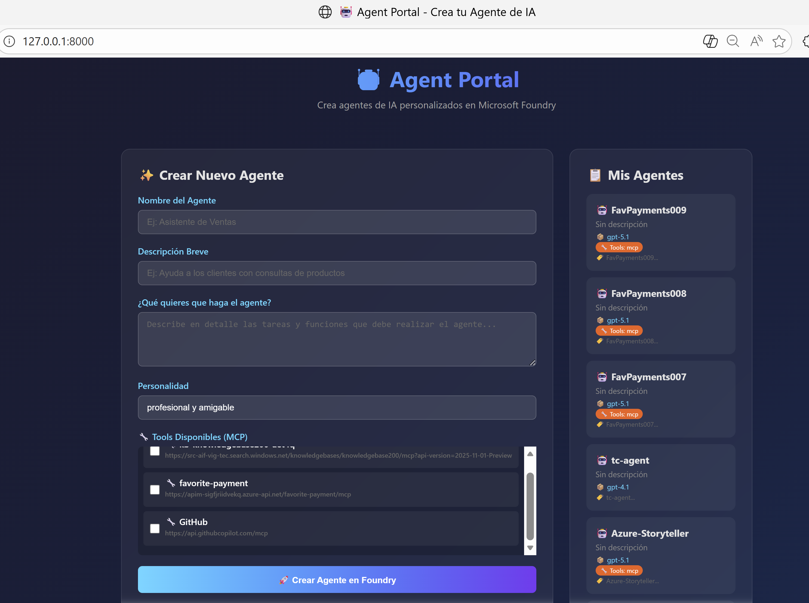

# 🧠 AI Agent Code Modernizer

**Track:** Reasoning Agents with Microsoft Foundry — [Agents League @ TechConnect 2026](https://github.com/microsoft/agentsleague-techconnect)  
**Starter Kit:** [2-reasoning-agents](https://github.com/microsoft/agentsleague-techconnect/tree/main/starter-kits/2-reasoning-agents)

An MCP-exposed AI agent that analyzes code written with **Semantic Kernel** or **AutoGen** and modernizes it to **Microsoft Agent Framework (MAF)**. Built to integrate with the [Agent Portal](https://github.com/misantibanez/AI-MAF-AGENT-CREATION) as an MCP tool, or used standalone via CLI/MCP in VS Code.

> This project was built with AI assistance using GitHub Copilot.

## 👥 Team

| Name | Alias |
|------|-------|
| Michelle Santibañez | michelle.santibanez@microsoft.com |
| Valentina G. | valentinag@microsoft.com |
| Emilio Raggi | emilioraggi@microsoft.com |
| Ana Franco | anafranco@microsoft.com |
| Jesus Sanchez | jesussan@microsoft.com |

## 🏗️ Architecture



The modernizer can be consumed in two ways:

1. **Via Agent Factory Portal** — The portal discovers and invokes the modernizer as a remote MCP tool, enabling no-code agent creation that includes code migration capabilities.
2. **Directly from VS Code** — Developers configure the MCP server in `.vscode/mcp.json` and use it through GitHub Copilot Chat or the CLI.

### Infrastructure

| Resource | Purpose |
|----------|---------|
| Azure Container Apps | Hosts the modernizer MCP server |
| Azure API Management | Exposes and secures the MCP endpoint |
| Azure Container Registry | Stores container images |
| Azure AI Foundry | Hosts the reasoning model (GPT-5.1) powering the agent |

## 🔌 Agent Portal Integration

The [Agent Portal](https://github.com/misantibanez/AI-MAF-AGENT-CREATION) is a web platform for creating and managing AI agents in Microsoft Foundry. The modernizer will be registered as an available MCP tool so agents created through the portal can leverage code migration capabilities.



## 🤖 ModernMint Agents

Custom GitHub Copilot agents with built-in memory, domain rules, and step-by-step instructions for performing modernizations. They encode the knowledge of how to analyze SK/AutoGen codebases and produce structured modernization artifacts:

| Agent | Purpose |
|-------|--------|
| `@modernmint-spec` | Scans the codebase and produces a modernization specification — defines **what** needs to change |
| `@modernmint-planner` | Reads the spec and generates a phased implementation plan — defines **how** to modernize step-by-step |

Each agent follows embedded instruction files (`.github/instructions/`) that define pattern recognition rules, migration mappings, and quality checklists. This enables consistent, repeatable modernizations across projects of any complexity.

Example outputs are included under `docs/specs/` and `plans/` (5-phase plan with quality checklists). Multi-AI support files (`AGENTS.md`, `CLAUDE.md`, `GEMINI.md`, `SKILL.md`) ensure the agents work across GitHub Copilot, Claude, and Gemini.

## 🛠️ Tools

The agent exposes three tools via MCP:

| Tool | Description |
|------|-------------|
| `analyze_code_patterns` | Detects SK or AutoGen patterns in source code (imports, plugins, planners, group chat, etc.) |
| `generate_modernized_code` | Produces equivalent MAF code from the analyzed input |
| `get_migration_guide` | Returns a comprehensive migration guide for the detected framework |

## 🚀 Quick Start

### Prerequisites

- Python 3.10+
- Azure CLI (`az login`)
- Azure AI Foundry project with a deployed reasoning model

### Setup

```bash
cd AIAppsModernization
python -m venv .venv
.venv\Scripts\activate       # Windows
pip install -r requirements.txt
```

Create a `.env` file:

```
FOUNDRY_PROJECT_ENDPOINT=https://<your-project>.services.ai.azure.com/...
FOUNDRY_MODEL_DEPLOYMENT_NAME=gpt-5.1
FOUNDRY_API_KEY=<your-key>
```

### Run

```bash
# MCP server (default — for GitHub Copilot / Agent Portal)
python main.py

# HTTP server (for debugging with Agent Inspector)
python main.py --server

# Interactive CLI
python main.py --cli
```

### Configure in VS Code

Add to `.vscode/mcp.json`:

```json
{
  "servers": {
    "code-modernizer": {
      "command": "python",
      "args": ["AIAppsModernization/main.py"]
    }
  }
}
```

## 📁 Project Structure

```
├── AIAppsModernization/
│   ├── main.py                 # Entry point — MCP, HTTP, or CLI mode
│   ├── modernizer_agent.py     # Agent definition and instructions
│   ├── tools.py                # Code analysis & generation tools
│   └── requirements.txt
├── SemanticKernelSamples/
│   ├── joke_agent_sk.py        # Sample SK app (input for testing)
│   └── joke_agent_autogen.py   # Sample AutoGen app (input for testing)
├── .github/agents/              # ModernMint custom Copilot agents
├── docs/specs/                  # Example modernization specification
├── plans/                       # 5-phase implementation plan with checklists
├── infrastructure/
│   └── template.json            # ARM template (Container Apps, APIM, ACR)
└── docs/
    ├── architecture.png
    └── agent-portal.png
```

## 🧪 Example

Feed the SK sample to the modernizer:

```
Analyze and modernize this Semantic Kernel agent to Microsoft Agent Framework:
<paste contents of SemanticKernelSamples/joke_agent_sk.py>
```

The agent will:
1. Detect Semantic Kernel patterns (Kernel, kernel_function, ChatHistory, etc.)
2. Generate equivalent MAF code using `AzureAIClient`, `create_agent`, and typed tool annotations
3. Return the migration guide with key differences

## 📚 Resources

- [Microsoft Foundry Docs](https://learn.microsoft.com/azure/ai-foundry/)
- [Agent Framework SDK](https://learn.microsoft.com/azure/ai-foundry/agents/overview?view=foundry)
- [MCP Specification](https://modelcontextprotocol.io/docs/getting-started/intro)
- [Agent Factory Portal](https://github.com/misantibanez/AI-MAF-AGENT-CREATION)
- [Challenge Starter Kit](https://github.com/microsoft/agentsleague-techconnect/tree/main/starter-kits/2-reasoning-agents)
